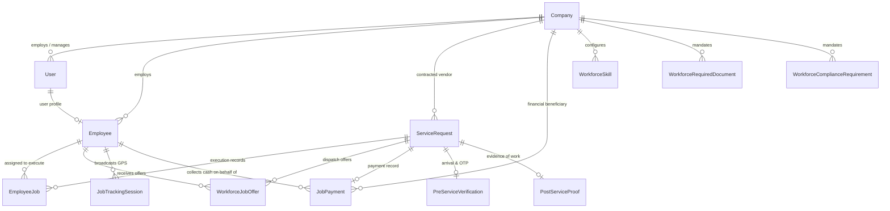
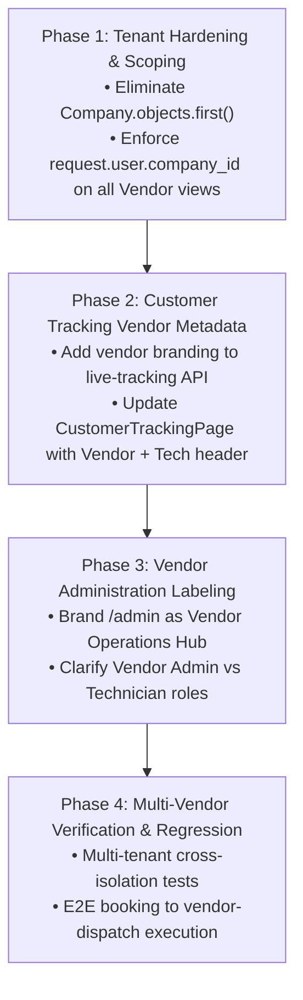

# CalTrack — Vendor / Service Company Architecture Audit

**Document Version:** 1.0.0  
**Target Codebase:** Workforce App (`workforce-app`)  
**Audit Scope:** Introducing Vendor / Service Company as the First-Class Business Actor Above Employees  
**Audit Date:** August 18, 2026  
**Auditor:** Antigravity Advanced Agentic Engineering System  

---

## Executive Summary & Core Finding

CalTrack is evolving from an individual technician dispatch model into a multi-tiered commercial service delivery hierarchy:

$$\text{Customer} \longrightarrow \text{Service Request / Booking} \longrightarrow \mathbf{Vendor / Service\ Company} \longrightarrow \mathbf{Vendor\ Employee / Technician} \longrightarrow \text{Job Execution}$$

### Primary Architectural Determination: `Company` IS `Vendor`
An exhaustive audit of all database models, migrations, and backend querysets reveals that **the existing `Company` model (`companies_company`) already represents the Vendor organization**.

> [!IMPORTANT]
> **DO NOT create a duplicate `Vendor`, `VendorCompany`, `ServiceProvider`, or `PartnerCompany` table.**  
> The existing `companies.Company` model is already the root tenant entity to which `User`, `Employee`, `ServiceRequest`, `JobPayment`, `JobTrackingSession`, `WorkforceWorkExtension`, `WorkforceSupplementalInvoice`, `WorkforceEmployeeSchedule`, `WorkforceSkill`, `WorkforceRequiredDocument`, and `WorkforceComplianceRequirement` are foreign-keyed.
> 
> Introducing a new `Vendor` table would introduce duplicate foreign keys, cause synchronization hazards, fracture row-level tenant isolation, and violate the core database integrity rules of the platform.

---

## Categorical System Status

```
┌──────────────────────────────────────────────────────────────────────────────────┐
│                               STATUS SUMMARY MATRIX                              │
├────────────────────────────┬─────────────────────────────────────────────────────┤
│ A. Already Supported       │ Relational Company hierarchy, FK links, multi-gate  │
│                            │ dispatch scoping, payment separation, extensions    │
├────────────────────────────┼─────────────────────────────────────────────────────┤
│ B. Partially Supported     │ Role permissions, Customer tracking vendor branding, │
│                            │ Dispatch auto-company resolution                    │
├────────────────────────────┼─────────────────────────────────────────────────────┤
│ C. Missing                 │ Vendor self-registration flow, Multi-tier role separation │
│                            │ (Platform Admin vs Vendor Admin vs Dispatcher)     │
├────────────────────────────┼─────────────────────────────────────────────────────┤
│ D. Conflicting             │ Single-tenant fallback (Company.objects.first()) in │
│                            │ views vs strict multi-tenant isolation rule         │
├────────────────────────────┼─────────────────────────────────────────────────────┤
│ E. Unsafe Assumptions      │ "Admin" routes assuming single-company ownership,   │
│                            │ Feedback model omitting direct Company FK           │
└────────────────────────────┴─────────────────────────────────────────────────────┘
```

---

## 1. Current Architecture

The CalTrack architecture connects two application layers over a shared Supabase PostgreSQL database:

```
                  ┌──────────────────────────────┐
                  │      CUSTOMER APPLICATION    │
                  │ (Booking, Tracking, Payments)│
                  └──────────────┬───────────────┘
                                 │
                                 ▼
                     SHARED SUPABASE POSTGRESQL
                     ├── companies_company
                     ├── accounts_user
                     ├── employees_employee
                     ├── service_requests_servicerequest
                     ├── service_requests_employeejob
                     └── workforce_* (operational state)
                                 ▲
                                 │
                  ┌──────────────┴───────────────┐
                  │    WORKFORCE HUB (CalTrack)   │
                  │   Django 5.1 + React 18 / Vite│
                  └──────────────────────────────┘
```

The system separates:
1. **Marketplace Domain:** Owns `Customer`, customer cart data, booking creation, initial pricing, and customer billing address.
2. **Workforce Domain:** Owns `Company` (Vendor operations), `Employee` (Technicians), eligibility evaluation, automatic dispatch, live road GPS tracking, on-site arrival verification (geofence + OTP), work scope extensions, proof of work, cash collection, and final completion.

---

## 2. Existing Company / Tenant Model

Defined in [`companies/models.py`](file:///c:/Users/user/Desktop/Projects/workforce-standalone/workforce-app/backend/companies/models.py):

```python
class Company(models.Model):
    company_name = models.CharField(max_length=255)
    display_id = models.CharField(max_length=50, unique=True, null=True, blank=True)
    slug = models.SlugField(max_length=255, unique=True, null=True, blank=True)
    primary_country = models.CharField(max_length=2, default="US")
    region = models.ForeignKey(Region, on_delete=models.SET_NULL, null=True, blank=True)
    default_state = models.CharField(max_length=100, blank=True, null=True)
    industry = models.CharField(max_length=100, blank=True, null=True)
    website = models.URLField(max_length=255, blank=True, null=True)
    timezone = models.CharField(max_length=50, default="UTC")
    data_region = models.CharField(max_length=50, default="us-east")
    address = models.TextField(blank=True, null=True)
    compliance_mode = models.CharField(max_length=20, default="strict")
    reschedule_rejection_strategy = models.CharField(max_length=30, default="auto_reassign")
    allowed_countries = models.JSONField(default=list, blank=True)
    team_size = models.CharField(max_length=100, blank=True, null=True)
    selected_modules = models.JSONField(default=list, blank=True)
    module_permissions = models.JSONField(default=dict, blank=True)
    is_active = models.BooleanField(default=True)
    created_at = models.DateTimeField(auto_now_add=True, null=True)
    updated_at = models.DateTimeField(auto_now=True, null=True)

    class Meta:
        managed = False
        db_table = "companies_company"
```

**Assessment:**
- `Company` possesses all commercial, compliance, regional, and organizational attributes needed for a Vendor.
- `display_id` (e.g. `VEND-001`, `CALS`) and `slug` support distinct multi-vendor identity.
- `selected_modules` and `module_permissions` allow platform admins to customize capabilities per vendor.

---

## 3. Existing Employee Model

Defined in [`employees/models.py`](file:///c:/Users/user/Desktop/Projects/workforce-standalone/workforce-app/backend/employees/models.py):

```python
class Employee(models.Model):
    user = models.OneToOneField(settings.AUTH_USER_MODEL, on_delete=models.CASCADE, related_name="employee_profile")
    company = models.ForeignKey('companies.Company', on_delete=models.CASCADE, related_name="employees")
    invited_by = models.ForeignKey(settings.AUTH_USER_MODEL, on_delete=models.SET_NULL, null=True, blank=True)
    employee_id = models.CharField(max_length=50)
    phone = models.CharField(max_length=30, blank=True)
    title = models.CharField(max_length=100, blank=True)
    hourly_rate = models.DecimalField(max_digits=10, decimal_places=2, default=0)
    bank_details = models.JSONField(default=dict, blank=True)  # Holds onboarding dossier, approved services, leaves
    is_online = models.BooleanField(default=False)
    current_availability = models.CharField(max_length=50, default="offline")
    is_active = models.BooleanField(default=True)

    class Meta:
        managed = False
        db_table = "employees_employee"
```

**Assessment:**
- Explicitly models an **individual field worker** belonging to a `Company`.
- Every employee has an immutable relation to `company_id`.
- The employee does not own the business or service catalog; the employee is an authorized operator under the Vendor.

---

## 4. Current Entity Relationships



### Detailed Relationship Audits:

| Relationship | DB Foreign Key | Nullable | Cardinality | Authoritative Status |
|:---|:---|:---:|:---:|:---|
| **Employee $\rightarrow$ Company** | `Employee.company_id` | **NO** | $N:1$ | **Authoritative:** Every employee must belong to exactly one Company. |
| **Job $\rightarrow$ Company** | `ServiceRequest.company_id` | YES (in DB) | $N:1$ | **Authoritative when assigned:** Represents the Vendor responsible for service. |
| **Job $\rightarrow$ Employee** | `ServiceRequest.assigned_employee_id` | YES | $N:1$ | **Operational Executor:** Represents the active field technician. |
| **Job $\rightarrow$ Execution Log** | `EmployeeJob.service_request_id` | **NO** | $1:N$ | **Immutable History:** Preserves all technicians assigned to a job across re-dispatches. |
| **Payment $\rightarrow$ Company** | `JobPayment.company_id` | YES | $N:1$ | **Vendor Accounting:** Attribution for financial settlement. |
| **Payment $\rightarrow$ Employee** | `JobPayment.cash_collected_by_id` | YES | $N:1$ | **Physical Handler:** Technician who collected physical cash. |

---

## 5. Current Authentication & Role Model

Defined in [`accounts/models.py`](file:///c:/Users/user/Desktop/Projects/workforce-standalone/workforce-app/backend/accounts/models.py):

```python
class User(AbstractBaseUser):
    company = models.ForeignKey('companies.Company', on_delete=models.CASCADE, null=True, blank=True)
    
    class Role(models.TextChoices):
        ADMIN    = "admin",    "Admin"
        MANAGER  = "manager",  "Manager"
        EMPLOYEE = "employee", "Employee"
        KIOSK    = "kiosk",    "Kiosk"
        CUSTOMER = "customer", "Customer"

    role = models.CharField(max_length=20, choices=Role.choices, default=Role.EMPLOYEE)
    is_staff = models.BooleanField(default=False)
    is_superuser = models.BooleanField(default=False)
```

### Authorization Boundaries:

```
Platform Superadmin (is_superuser=True)
   └── Cross-vendor visibility, global configuration, system metrics
         │
Vendor Admin / Owner (role='admin' / 'manager', company_id=X)
   └── Scoped to Company X: Manage technicians, view company jobs, dispatch, view earnings
         │
Vendor Dispatcher / Coordinator (role='manager', company_id=X)
   └── Scoped to Company X: Live fleet monitoring, dispatch intervention, reassignment
         │
Technician / Employee (role='employee', company_id=X)
   └── Scoped to Employee ID: View assigned jobs, live tracking, execution, cash collection
         │
Customer (role='customer')
   └── Scoped to Customer User ID: View own bookings, tracking page, OTP, receipt
```

---

## 6. Dispatch & Offer Architecture Audit

In [`automatic_dispatch.py`](file:///c:/Users/user/Desktop/Projects/workforce-standalone/workforce-app/backend/workforce_api/services/automatic_dispatch.py):

```python
# Lines 366-367:
if job_obj.company_id:
    candidates_qs = candidates_qs.filter(company_id=job_obj.company_id)
```

### How Dispatch Operates Today:
1. **Vendor Scoping:** If a `ServiceRequest` has `company_id` set (e.g. Vendor ABC), the candidate search is strictly constrained to `Employee.objects.filter(company_id=job_obj.company_id)`.
2. **9-Gate Verification:** All 9 operational gates are evaluated server-side per technician:
   - G1: Active account
   - G2: Approved onboarding dossier
   - G3: Mandatory documents valid & approved
   - G4: Mandatory compliance certificates valid
   - G5: Working schedule (day of week & time window)
   - G6: Service category / skill verification
   - G7: Live presence (`is_online=True` & `current_availability='available'`)
   - G8: Absence / approved leave check
   - G9: Single-active-job concurrency isolation
3. **Geo-Proximity Ranking:** Ranks eligible vendor technicians within 50 km using real-time GPS telemetry.
4. **Offer Issuance:** Creates `WorkforceJobOffer(job=job, employee=candidate)` with a 5-minute expiry timer.

### Assessment of Dispatch Architecture:
- **No changes needed to the core 9-gate engine.**
- When CalTrack selects a Vendor for a Booking (or when Marketplace routes to a specific Vendor), the dispatch service automatically restricts candidates to that Vendor's technicians.

---

## 7. Payments & Financial Responsibility Separation

| Dimension | Customer Payment | Vendor Commercial Accounting | Technician Operational Handling |
|:---|:---|:---|:---|
| **Actor** | Customer | Vendor Company (`Company`) | Technician (`Employee`) |
| **Model** | `JobPayment` / `WorkforceSupplementalInvoice` | `JobPayment.company_id` | `JobPayment.cash_collected_by_id` |
| **Online Gateway** | Razorpay / Stripe to Platform/Vendor escrow | Net payable credited to Vendor ledger | Not involved in money flow |
| **Cash on Service (COD)**| Customer hands cash to technician | Vendor is debited/credited in platform settlement | Technician records exact cash received; verified via Customer Payment OTP or Direct Confirmation |
| **State Machine** | `PENDING` $\rightarrow$ `PAID` / `CASH_PENDING` $\rightarrow$ `PAID` | Reconciliation / Pay Period Settlement | Invariant: Job cannot be marked `COMPLETED` while cash is unconfirmed |

---

## 8. Customer Tracking Experience Audit

In [`CustomerTrackingPage.jsx`](file:///c:/Users/user/Desktop/Projects/workforce-standalone/workforce-app/frontend/src/pages/customer/CustomerTrackingPage.jsx) and [`views.py`](file:///c:/Users/user/Desktop/Projects/workforce-standalone/workforce-app/backend/workforce_api/views.py) (`WorkforceJobLiveTrackingView`):

### Current State:
- Endpoint: `GET /api/workforce/customer/jobs/<jobId>/tracking/`
- Data returned:
  - `status` (e.g. `ACCEPTED`, `ON_THE_WAY`, `ARRIVED`, `IN_PROGRESS`, `COMPLETED`)
  - `assigned_technician`: `{ name, title, rating, phone, photo, location }`
  - `customer_location`: `{ address, latitude, longitude }`
  - `start_otp`: Work start verification OTP
  - `distance_m`: Distance in meters
  - `freshness_state`: GPS telemetry health (`LIVE`, `UPDATING`, `DELAYED`, `LOCATION_LOST`)

### Required Vendor Extension in Customer UI:
Customer should see both the **Responsible Vendor Company** and the **Executing Technician**:

$$\boxed{\text{Service Provider: \textbf{ABC Home Services Pvt Ltd}} \quad \vert \quad \text{Assigned Professional: \textbf{Ravi Kumar (★ 4.9)}}}$$

---

## 9. Codebase Assumptions & Gaps Analysis

### A. Already Supported
1. **Relational Models:** `Company`, `Employee`, `ServiceRequest`, `JobPayment`, `JobTrackingSession`, `WorkforceWorkExtension` all have relational foreign keys.
2. **Strict Multi-Gate Dispatch:** Candidate filtering already supports `company_id` scoping.
3. **Decoupled Presence:** `PresenceLog` and `Employee.is_online` operate independently of job status.
4. **Execution History:** `EmployeeJob` tracks all technician assignments per job.
5. **Payment Audit:** `PaymentCollectionEvent` tracks every cash collection lifecycle event.

### B. Partially Supported
1. **Tenant Resolution in Views:** `get_request_company(request)` uses `request.user.company` or `request.user.employee_profile.company`, but has fallback to `Company.objects.first()`.
2. **Customer Tracking Response:** Returns technician details and generic company name, but lacks formal `vendor` block in telemetry payload.
3. **Admin Dashboard:** Currently labeled "Workforce Admin" rather than "Vendor Operations Portal".

### C. Missing
1. **Vendor Self-Registration / Invite:** Currently, `WorkforceSignupView` signs up individual technicians into `Company.objects.first()`. A vendor onboarding or admin invite flow is needed for multi-vendor self-service.
2. **Explicit Multi-Tenant Scoping on Feedback:** `WorkforceJobFeedback` is linked to `job`, `employee`, and `customer`, but lacks a direct `company` foreign key (must traverse `job.company`).

### D. Conflicting / Unsafe Patterns
1. **`Company.objects.first()` Fallbacks:**  
   Found in:
   - `workforce_api/views.py` (lines 108, 113, 127, 4807, 4824)
   - `test_employee_platform_integration.py` (line 220)  
   *Resolution:* Must fail safely with `HTTP 403 Forbidden / 400 Bad Request` if tenant context cannot be resolved from the authenticated user token.
2. **Role Ambiguity (`admin` vs `superuser`):**  
   A user with `role="admin"` could be interpreted as a Platform Superadmin or a Vendor Admin.  
   *Resolution:* Treat `role="admin"` with `is_superuser=False` as **Vendor Admin** (strictly scoped to `user.company_id`). Treat `is_superuser=True` as **Platform Superadmin**.

---

## 10. Required Architectural Changes

```
┌──────────────────────────────────────────────────────────────────────────────────┐
│                         ARCHITECTURAL EVOLUTION ROADMAP                          │
├──────────────────────────────────────────────────────────────────────────────────┤
│ 1. AFFIRM COMPANY AS VENDOR                                                      │
│    Document and treat companies_company as the sole Vendor entity.              │
│    Zero duplicate organization models.                                           │
├──────────────────────────────────────────────────────────────────────────────────┤
│ 2. PURGE TENANT FALLBACKS                                                        │
│    Replace all Company.objects.first() with strict request.user tenant scoping.  │
├──────────────────────────────────────────────────────────────────────────────────┤
│ 3. CLARIFY THREE OPERATIONAL PORTALS                                             │
│    • /workforce/admin     -> Vendor Operations (Vendor Admin/Dispatcher)         │
│    • /workforce/employee  -> Field Technician Mobile Workspace                   │
│    • /customer/track      -> Customer Live Tracking (Vendor + Tech display)      │
├──────────────────────────────────────────────────────────────────────────────────┤
│ 4. ENHANCE CUSTOMER TRACKING PAYLOAD                                             │
│    Include vendor metadata (vendor_name, vendor_phone, vendor_support_email).   │
├──────────────────────────────────────────────────────────────────────────────────┤
│ 5. PRESERVE CORE STATE MACHINES                                                  │
│    Keep unchanged: 9-gate dispatch, GPS tracking, OTP verification,              │
│    time logging, post-service proof, cash collection, and completion criteria.   │
└──────────────────────────────────────────────────────────────────────────────────┘
```

---

## 11. What NOT to Change

1. **DO NOT create a `Vendor` table** — `Company` is already the Vendor entity.
2. **DO NOT change `Employee`** — Field technicians remain individual employees linked to `Company`.
3. **DO NOT change `ServiceRequest` state transitions** — The status flow (`confirmed` $\rightarrow$ `assigned` $\rightarrow$ `on_the_way` $\rightarrow$ `arrived` $\rightarrow$ `in_progress` $\rightarrow$ `completed`) remains identical.
4. **DO NOT alter 9-gate dispatch algorithms** — Eligibility criteria remain unchanged.
5. **DO NOT alter the single-active-job invariant** — Technicians can still only execute one active job at a time.
6. **DO NOT alter the 5-minute cancellation window or re-dispatch mechanisms.**
7. **DO NOT introduce external messaging queues (Celery, Kafka, Redis)** — Retain current synchronous transactional database design.

---

## 12. Recommended Implementation Phases



---

## Conclusion & Architectural Sign-Off

The CalTrack codebase is **architecturally sound and already positioned** for the `Customer → Vendor → Employee → Job Execution` model. 

Because `Company` already represents the Vendor entity and is linked to all operational models, **no disruptive schema migrations or duplicate tables are required**. The required work consists strictly of:
1. Hardening tenant isolation (eliminating prototype `Company.objects.first()` fallbacks).
2. Clarifying role scoping between Platform Superadmin and Vendor Admin.
3. Exposing Vendor business identity alongside Technician operational identity in the Customer experience.
