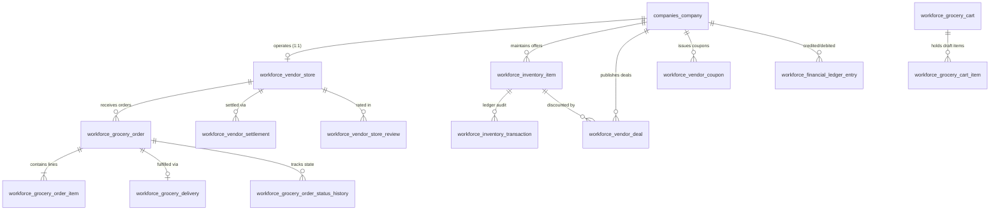

# 02. Database Schema Specification

## PostgreSQL Physical Schema

The multi-vendor marketplace uses a relational model under `workforce_api` schema.

## Relational Tables & Constraints

### 1. `companies_company` (Extension)
- `business_type`: `VARCHAR(50)` (`service_provider`, `grocery_supplier`, `hybrid`).

### 2. `workforce_vendor_store`
- `id`: Primary Key
- `company_id`: OneToOne to `companies_company` (Cascade)
- `store_name`: `VARCHAR(255)`
- `store_slug`: `VARCHAR(255)` Unique
- `tagline`: `VARCHAR(255)`
- `fssai_license_number`: `VARCHAR(100)`
- `latitude`, `longitude`: `DECIMAL(9, 6)`
- `delivery_radius_km`: `DECIMAL(6, 2)` (Default: 5.0)
- `minimum_order_amount`: `DECIMAL(10, 2)`
- `estimated_delivery_mins`: `INTEGER` (Default: 30)
- `is_accepting_orders`: `BOOLEAN` (Default: true)
- `rating_average`: `DECIMAL(3, 2)` (Default: 5.00)
- `total_reviews`: `INTEGER` (Default: 0)

### 3. `workforce_inventory_item` (Vendor Offer)
- `id`: Primary Key
- `company_id`: ForeignKey to `companies_company`
- `catalogue_service_id`: Integer pointer to canonical master product
- `name_snapshot`, `catalogue_image_url`: Master snapshot
- `custom_name`, `custom_image_url`: Vendor overrides
- `custom_price`: `DECIMAL(10, 2)`
- `mrp`: `DECIMAL(10, 2)`
- `quantity_in_stock`: `DECIMAL(12, 3)`
- `reserved_quantity`: `DECIMAL(12, 3)` (Default: 0.000)
- `unit`: `VARCHAR(20)` (`kg`, `g`, `piece`, `bunch`, `packet`)
- `low_stock_threshold`: `DECIMAL(12, 3)`
- `is_available`: `BOOLEAN` (Default: true)
- **Constraint**: Unique on `[company, catalogue_service_id]`

### 4. `workforce_inventory_transaction` (Stock Ledger)
- `id`: Primary Key
- `inventory_item_id`: ForeignKey to `workforce_inventory_item`
- `transaction_type`: `INITIAL_STOCK`, `PURCHASE`, `ADJUSTMENT`, `RESERVATION`, `RESERVATION_RELEASE`, `SALE`, `CANCELLATION`, `RETURN`, `DAMAGE`, `EXPIRED`
- `quantity`: `DECIMAL(12, 3)`
- `balance_after`: `DECIMAL(12, 3)`
- `reference_id`: `VARCHAR(100)` (Order number or cart ID)
- `notes`: `TEXT`
- `created_at`: `TIMESTAMP`

### 5. `workforce_vendor_deal`
- `id`: Primary Key
- `company_id`: ForeignKey to `companies_company`
- `inventory_item_id`: ForeignKey to `workforce_inventory_item`
- `deal_type`: `strike_through`, `flash_sale`, `volume_discount`
- `original_price`, `deal_price`: `DECIMAL(10, 2)`
- `deal_start_at`, `deal_end_at`: `TIMESTAMP`
- `badge_text`: `VARCHAR(50)`
- `is_active`: `BOOLEAN`

### 6. `workforce_vendor_coupon`
- `id`: Primary Key
- `company_id`: ForeignKey to `companies_company`
- `code`: `VARCHAR(50)`
- `discount_type`: `percent`, `flat`
- `discount_value`: `DECIMAL(10, 2)`
- `min_order_amount`: `DECIMAL(10, 2)`
- `max_discount_amount`: `DECIMAL(10, 2)`
- `usage_limit_total`: `INTEGER`
- `usage_limit_per_user`: `INTEGER` (Default: 1)
- `times_used`: `INTEGER` (Default: 0)
- **Constraint**: Unique on `[company, code]`

### 7. `workforce_grocery_order`
- `id`: Primary Key
- `order_number`: `VARCHAR(50)` Unique
- `customer_id`: `VARCHAR(100)`
- `customer_name`, `customer_phone`: `VARCHAR`
- `delivery_address`: `TEXT`
- `vendor_store_id`: ForeignKey to `workforce_vendor_store`
- `status`: `PENDING_PAYMENT`, `CONFIRMED`, `VENDOR_PENDING`, `ACCEPTED`, `PICKING`, `PACKED`, `READY_FOR_PICKUP`, `OUT_FOR_DELIVERY`, `DELIVERED`, `CANCELLED`, `VENDOR_REJECTED`, `REFUNDED`
- `subtotal`, `deal_discount`, `vendor_coupon_discount`, `delivery_fee`, `tax`, `total_amount`: `DECIMAL(10, 2)`
- `applied_coupon_code`: `VARCHAR(50)`
- `placed_at`, `accepted_at`, `packed_at`, `out_for_delivery_at`, `delivered_at`, `cancelled_at`: `TIMESTAMP`

### 8. `workforce_financial_ledger_entry`
- `id`: Primary Key
- `company_id`: ForeignKey to `companies_company`
- `entry_type`: `CREDIT`, `DEBIT`
- `category`: `SALE`, `COMMISSION`, `DISCOUNT_DEDUCTION`, `PAYOUT`, `ADJUSTMENT`
- `amount`: `DECIMAL(12, 2)`
- `order_id`: ForeignKey to `workforce_grocery_order` (Null allowed)
- `description`: `TEXT`
- `created_at`: `TIMESTAMP`
