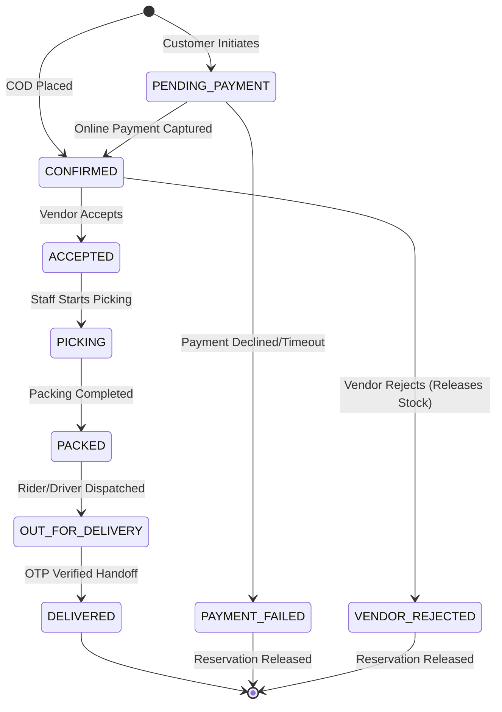

# 05. Grocery Order State Machine

## Finite State Machine Diagram

## State Definitions & Triggers

| State | Trigger | Invariant / Side Effect |
| :--- | :--- | :--- |
| `PENDING_PAYMENT` | Checkout (Online) | Stock reserved via `RESERVATION` ledger; 15 min expiry. |
| `CONFIRMED` | Checkout (COD) or Payment Success | Order appears on vendor dashboard as New Order. |
| `ACCEPTED` | Vendor clicks Accept | Order acknowledged; `accepted_at` recorded. |
| `PICKING` | Vendor starts picking | In-store item preparation. |
| `PACKED` | Vendor completes packing | Packed produce sealed with bag label. |
| `OUT_FOR_DELIVERY`| Rider dispatched | Delivery OTP shared with customer. |
| `DELIVERED` | Driver inputs customer OTP | Physical stock decremented (`SALE` ledger); Net earnings credited to Financial Ledger. |
| `VENDOR_REJECTED`| Vendor clicks Reject | `reserved_quantity` decremented; `RESERVATION_RELEASE` recorded. |
| `CANCELLED` | Customer cancels before packing | Stock released; refund initiated if online payment. |

## Concurrency Protection
- All state transitions execute inside `transaction.atomic()`.
- Invalid transitions (e.g. `DELIVERED` → `CANCELLED` or `VENDOR_REJECTED` → `ACCEPTED`) are rejected by the backend with HTTP 400.
