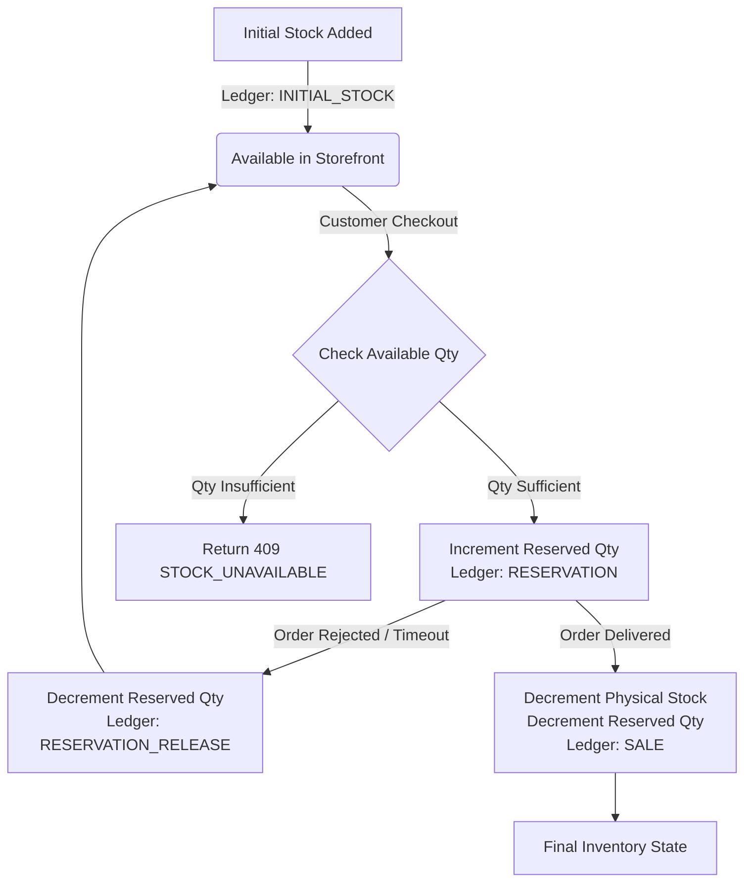

# 06. Multi-Vendor Inventory State Machine

## Stock Equation
The system enforces a dual-quantity inventory model:

$$\text{Available Stock} = \max\left(0, \text{Quantity in Stock} - \text{Reserved Quantity}\right)$$



## Inventory Transaction Types
1. `INITIAL_STOCK`: First stock intake when vendor adds product offer.
2. `PURCHASE`: Restock from wholesale mandi/farm suppliers.
3. `ADJUSTMENT`: Manual cycle count correction by store manager.
4. `RESERVATION`: Locked during active customer checkout.
5. `RESERVATION_RELEASE`: Unlocked when checkout times out or vendor rejects order.
6. `SALE`: Permanently deducted upon verified order delivery.
7. `CANCELLATION`: Customer returns cancelled item before delivery.
8. `DAMAGE`: Physical damage during handling.
9. `EXPIRED`: Perishable produce spoilage write-off.

## Concurrency Row-Locking
During checkout:
```python
with transaction.atomic():
    locked_items = {
        item.id: item
        for item in cart.vendor_store.company.inventory_items.select_for_update().filter(id__in=item_ids)
    }
    for item in cart_items:
        if locked_items[item.id].available_quantity < item.quantity:
            raise StockUnavailableConflict()
```
Two simultaneous checkouts for the same produce stock will be executed sequentially by PostgreSQL; the first succeeds and the second fails with `STOCK_UNAVAILABLE`. Stock is never negative.
