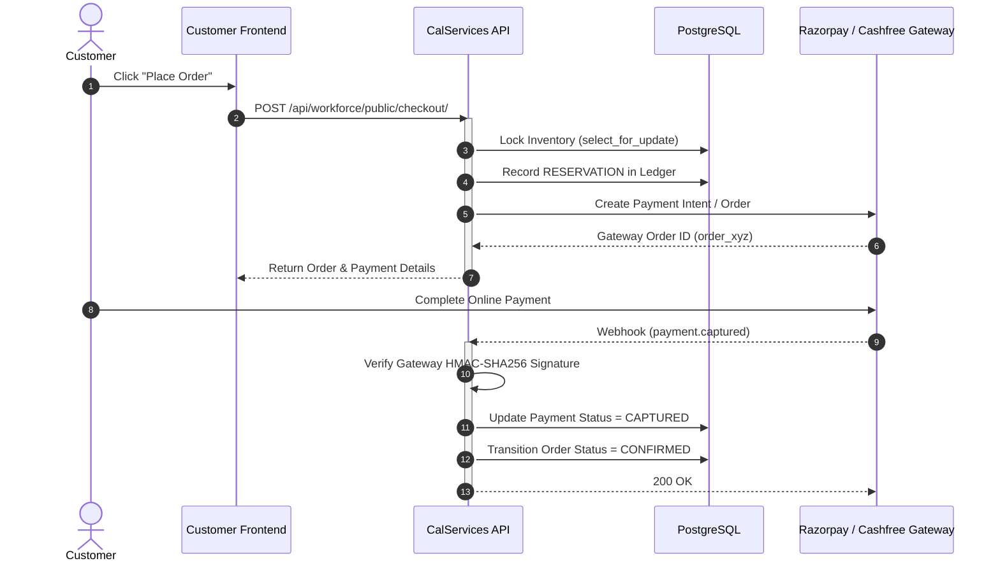

# 07. Payment Architecture & Webhook Verification

## Supported Payment Rails
1. **Cash on Delivery (COD)**:
   - Order confirmed immediately.
   - Payment status remains `PENDING` until delivery handoff.
   - Delivery OTP entry by driver marks payment `CAPTURED`.
2. **Online Payment (Razorpay / Cashfree)**:
   - Order placed in `PENDING_PAYMENT` state with 15-minute reservation window.
   - Gateway webhook confirms capture and transitions order to `CONFIRMED`.

## Payment Sequence

## Security & Idempotency Rules
1. **Never Trust Client Flag**: `payment_success=true` sent from frontend is strictly ignored. Only verified backend server-to-server callbacks or verified HMAC webhooks update payment state.
2. **Webhook Replay Protection**: Each webhook event ID is recorded in `WorkforceWebhookEvent` table; duplicate webhooks return HTTP 200 without executing duplicate transactions.
3. **Automatic Rollback on Failure**: If payment fails or times out after 15 minutes, a background cron job executes `RESERVATION_RELEASE` for all order items.
