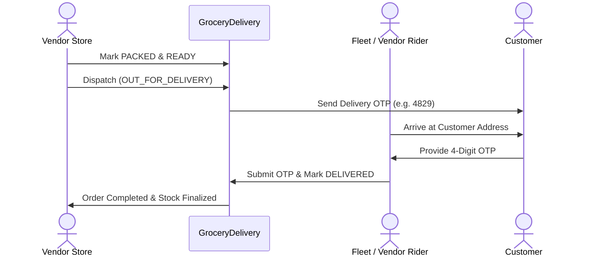

# 08. Fulfillment & Delivery Flow

## Fulfillment Abstraction
The system supports multiple delivery models via the unified `FulfillmentMethod` enum:
1. `VENDOR_DELIVERY`: Vendor employs their own delivery boys/vehicles.
2. `PLATFORM_RIDER`: CalServices fleet riders assigned via automated spatial dispatch.
3. `THIRD_PARTY`: Hyperlocal delivery partners (Dunzo, Porter, Rapido).
4. `CUSTOMER_PICKUP`: Customer clicks and collects directly from vendor store.

## Delivery Lifecycle

## OTP Handoff Security
- A cryptographically random 4-digit OTP is generated on order creation and stored in `GroceryDelivery.delivery_otp`.
- The customer views the OTP on their live order tracking screen.
- Delivery completion requires verifying this OTP, preventing false delivery disputes.
