# 02. Database Schema & Relational Models

## 1. Physical Schema Architecture

The Workforce platform operates on a PostgreSQL relational database (Supabase Cloud). It utilizes a mix of managed models (core workforce functionality) and unmanaged mirror models (shared tables owned by the Marketplace backend).

```mermaid
erDiagram
    accounts_user ||--o| employees_employee : "has profile"
    companies_company ||--o{ employees_employee : "employs"
    companies_company ||--o{ employees_skill : "defines"
    
    employees_employee ||--o{ employees_employeedocument : "holds documents"
    employees_employee ||--o{ employees_employeecompliance : "tracks compliance"
    employees_employee ||--o{ employees_employeeleave : "requests leave"
    employees_employee ||--o{ employees_employeeservice : "certified for"
    employees_employee ||--o{ employees_employeeskill : "possesses"
    employees_employee ||--o{ time_tracking_workshift : "logs shifts"
    employees_employee ||--o{ time_tracking_gpsbreadcrumb : "streams location"
    
    companies_company ||--o{ service_requests_servicerequest : "assigned company"
    employees_employee ||--o{ service_requests_servicerequest : "assigned technician"
    service_requests_servicerequest ||--o{ service_requests_tripstop : "multi-leg stops"
    service_requests_tripstop ||--o{ service_requests_package : "contains packages"
    service_requests_tripstop ||--o| service_requests_deliveryproof : "proof of delivery"
    
    service_requests_servicerequest ||--o{ workforce_api_workforcejoboffer : "dispatch offers"
    service_requests_servicerequest ||--o{ workforce_api_workforcenote : "job audit notes"
    service_requests_servicerequest ||--o{ workforce_api_workforcejoblocation : "job GPS trace"
    service_requests_servicerequest ||--o{ workforce_api_quotation : "quotation extensions"
    
    companies_company ||--o| vendor_wallet_walletaccount : "company wallet"
    employees_employee ||--o| vendor_wallet_employeewallet : "technician wallet"
    vendor_wallet_walletaccount ||--o{ vendor_wallet_financialledgerentry : "company entries"
    vendor_wallet_employeewallet ||--o{ vendor_wallet_employeeledgerentry : "technician entries"
    vendor_wallet_walletaccount ||--o{ vendor_wallet_withdrawalrequest : "withdrawal requests"
    
    companies_company ||--o{ inventory_inventoryitem : "stock catalog"
    inventory_inventoryitem ||--o{ inventory_stockmovement : "stock audit ledger"
```

---

## 2. Detailed Data Models

### 2.1 `companies.Company`
Core multi-tenant organization entity.
- `id`: BigAutoField Primary Key.
- `name`: `VARCHAR(255)` Organization display name.
- `business_type`: `VARCHAR(50)` (`service_provider`, `grocery_supplier`, `hybrid`).
- `address`: `TEXT` Registered physical address.
- `latitude`, `longitude`: `DECIMAL(9, 6)` Geolocation coordinates.
- `phone`, `email`: Contact details.
- `created_at`, `updated_at`: Timestamps.

### 2.2 `employees.Employee`
Represents field technicians and operational staff.
- `id`: BigAutoField Primary Key.
- `user_id`: OneToOne to `accounts.User`.
- `company_id`: ForeignKey to `companies.Company`.
- `account_type`: `VARCHAR(50)` (`technician`, `driver`, `contractor`, `sub_vendor`).
- `registration_status`: `VARCHAR(50)` (`PENDING`, `APPROVED`, `REJECTED`, `CORRECTION_REQUIRED`).
- `approval_status`: `VARCHAR(50)` (`DRAFT`, `UNDER_REVIEW`, `APPROVED`, `SUSPENDED`).
- `is_active`: `BOOLEAN` Account active state.
- `is_online`: `BOOLEAN` Real-time operational availability toggle.
- `is_busy`: `BOOLEAN` Set to `true` when currently executing an active job.
- `current_latitude`, `current_longitude`: `DOUBLE PRECISION` Latest streamed GPS coordinate.
- `last_location_update`: `TIMESTAMP WITH TIME ZONE` Heartbeat timestamp.
- `rating_average`: `DECIMAL(3, 2)` Cumulative 5-star customer rating average.
- `completed_jobs_count`: `INTEGER` Total successfully fulfilled jobs.

### 2.3 `employees.EmployeeDocument` & `EmployeeCompliance`
Mandatory verification models for field eligibility.
- `employee_id`: ForeignKey to `Employee`.
- `document_type`: `VARCHAR(50)` (Aadhaar, Driving License, PAN, Police Verification, Trade Certification).
- `file_url`: S3 / Supabase storage path.
- `verification_status`: `VARCHAR(50)` (`PENDING`, `APPROVED`, `REJECTED`).
- `rejection_reason`: `TEXT` Feedback for corrections.
- `expires_at`: `DATE` Document expiry.

### 2.4 `service_requests.ServiceRequest` (Shared Model)
Shared operational contract for customer bookings and field dispatches.
- `id`: Primary Key (`SR-XXXX` canonical ID).
- `customer_id`: ForeignKey to Customer `User` (owned by Marketplace).
- `assigned_employee_id`: ForeignKey to `Employee` (owned by Workforce).
- `company_id`: ForeignKey to `Company`.
- `status`: State enum (`new_request`, `confirmed`, `assigned`, `accepted`, `on_the_way`, `arrived`, `in_progress`, `proof_submitted`, `completed`, `cancelled`).
- `payment_method`: `VARCHAR(20)` (`COD`, `ONLINE`).
- `payment_status`: `VARCHAR(20)` (`pending`, `collected`, `refunded`).
- `total_amount`: `DECIMAL(10, 2)` Total billable amount.
- `service_latitude`, `service_longitude`: `DOUBLE PRECISION` Customer site GPS coordinates.
- `cart_data`: `JSONB` Cart line items, pre/post photo proof URLs, OTP verification logs, and cash receipts.

### 2.5 Multi-Leg Delivery Models (`service_requests`)
- **`TripStop`**: Represents individual pickup or drop locations along a route (`sequence_number`, `stop_type` [PICKUP/DROP], `status` [PENDING, ARRIVED, COMPLETED], `address`, `lat`, `lng`, `scheduled_at`, `completed_at`).
- **`Package`**: Packages assigned to a trip stop (`tracking_number`, `weight_kg`, `dimensions_cm`, `is_fragile`, `status`).
- **`DeliveryProof`**: Proof artifact for drop-offs (`recipient_name`, `recipient_phone`, `signature_url`, `photo_url`, `otp_verified`, `cash_collected_amount`).

### 2.6 `workforce_api.WorkforceJobOffer`
Manages concurrency-safe, time-bounded dispatch offers to candidates.
- `id`: UUID / BigAutoField.
- `service_request_id`: ForeignKey to `ServiceRequest`.
- `employee_id`: ForeignKey to `Employee`.
- `status`: `VARCHAR(20)` (`OFFERED`, `ACCEPTED`, `REJECTED`, `EXPIRED`, `CANCELLED`).
- `offered_at`: `TIMESTAMP WITH TIME ZONE`.
- `expires_at`: `TIMESTAMP WITH TIME ZONE` (typically `offered_at + 5 minutes`).
- `distance_km`: `DECIMAL(6, 2)` Candidate distance at dispatch time.

### 2.7 Quotations & Estimations (`workforce_api`)
- **`Quotation`**: Top-level estimation request (`service_request_id`, `company_id`, `created_by`, `status` [DRAFT, SUBMITTED, APPROVED, REJECTED, EXPIRED], `subtotal`, `tax_amount`, `discount_amount`, `grand_total`, `decision_token`, `approved_at`).
- **`QuotationItem`**: Line items (`item_type` [LABOR, MATERIAL, SPARE_PART, FEE], `description`, `quantity`, `unit_price`, `total_price`).
- **`TechnicianInspectionSheet`**: On-site diagnosis data (`job_id`, `inspector_id`, `inspection_type` [MASONRY, PAINTING, HVAC, GENERAL], `measurements_data` [JSONB], `diagnostic_notes`, `images` [JSONB]).

### 2.8 Wallets & Financial Ledgers (`vendor_wallet`)
- **`WalletAccount`**: Company-level business wallet (`company_id`, `balance`, `pending_balance`, `currency`).
- **`EmployeeWallet`**: Field technician wallet (`employee_id`, `floating_cash_balance`, `earned_balance`).
- **`FinancialLedgerEntry`**: Double-entry ledger (`wallet_id`, `entry_type` [CREDIT, DEBIT], `transaction_type` [JOB_EARNING, COMMISSION, CASH_COLLECTION, WITHDRAWAL, ADJUSTMENT], `amount`, `balance_after`, `reference_id`, `notes`).
- **`WithdrawalRequest`**: Payout requests (`company_id`, `bank_account_id`, `amount`, `status` [PENDING, APPROVED, PROCESSED, REJECTED], `processed_at`, `payout_reference`).

### 2.9 Stock & Inventory (`inventory`)
Unmanaged mirror models reflecting the central warehouse stock ledger.
- **`InventoryItem`**: Stock catalog item (`org_id`, `name`, `category`, `sku`, `warehouse_name`, `total_quantity`, `available_quantity`, `reserved_quantity`, `unit_cost`, `stock_quantity_grams`, `default_daily_quantity_grams`, `unit`).
- **`StockMovement`**: Immutable stock movement audit log (`org_id`, `item_id`, `movement_type` [RESTOCK, ADJUSTMENT, DAILY_RESET, SOLD, RESTOCKED_ON_CANCELLATION], `delta_grams`, `balance_after_grams`, `reason`, `booking_ref`, `entered_by_id`).
