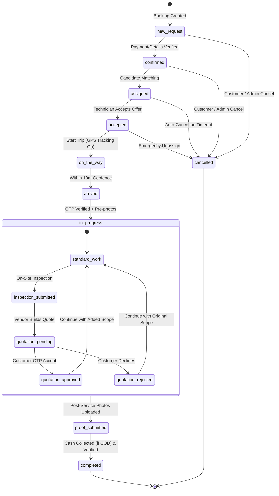
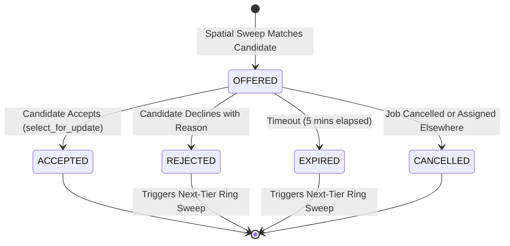
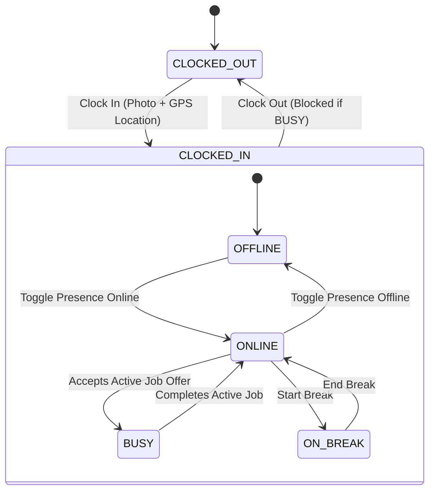
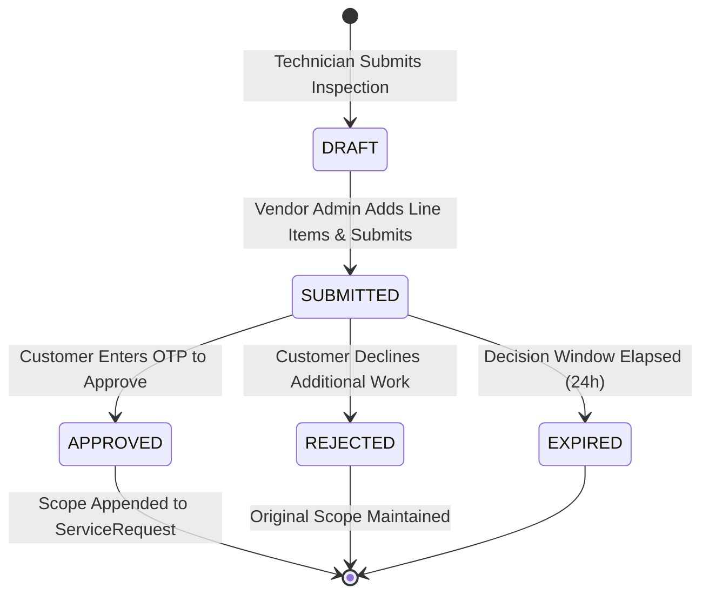
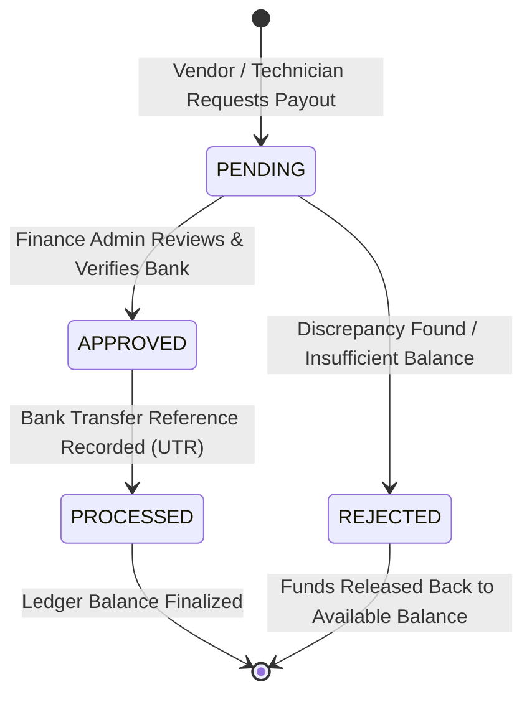

# 04. State Machines & Operational Lifecycles

## 1. ServiceRequest (Job Execution) State Machine

Every operational job lifecycle is enforced by server-side state transitions. Invalid transitions are strictly rejected with HTTP 409 Conflict.

### Transition Validation Rules
| From State | Allowed To State | Required Trigger & Server Validations |
| :--- | :--- | :--- |
| `new_request` | `confirmed` | Initial customer validation & payment authorization. |
| `confirmed` | `assigned` | Automatic or Admin dispatch links candidate `Employee`. |
| `assigned` | `accepted` | Technician accepts `WorkforceJobOffer`; employee flagged as `is_busy = true`. |
| `accepted` | `on_the_way` | Technician clicks "Start Trip"; GPS breadcrumb session initialized. |
| `on_the_way` | `arrived` | Haversine distance to job site must be $\le 10\text{ meters}$. |
| `arrived` | `in_progress` | 6-digit customer start OTP verified + minimum 3 pre-service photos uploaded. |
| `in_progress` | `proof_submitted`| Mandatory post-service photo proof uploaded. |
| `proof_submitted`| `completed` | If `payment_method == 'COD'`, `payment_status` must be `collected`; resets `is_busy = false`. |

---

## 2. WorkforceJobOffer State Machine

Manages candidate offers during automatic dispatch sweeps.

---

## 3. Technician Availability & Shift Lifecycle

Separates attendance (shifts) from real-time operational availability (presence).

---

## 4. Quotation & Additional Work Lifecycle

---

## 5. Wallet Withdrawal & Payout Lifecycle

