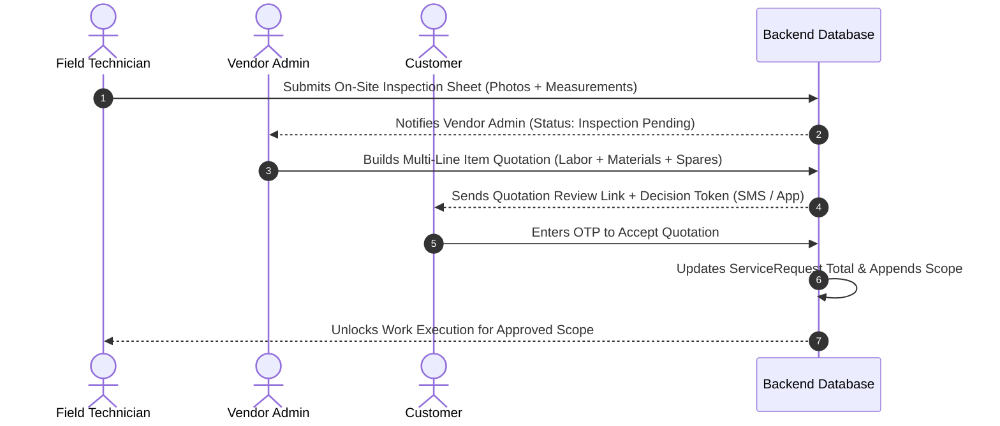

# 07. Estimations & Quotation Engine

## 1. Overview & Workflow

For complex trade jobs (masonry, painting, HVAC repair, electrical rewiring) where final costs cannot be predetermined at initial booking, the platform provides a digital Estimation & Quotation subsystem.

---

## 2. On-Site Technician Inspection Sheets

Technicians use domain-specific mobile inspection forms to capture structured field diagnostics:

### 2.1 Supported Inspection Types
- **Painting Inspection (`PaintingInspectionForm.jsx`):** Wall surface condition, square footage measurements, moisture readings, primer requirement, recommended paint grade.
- **Masonry & Tiling (`MasonInspectionForm.jsx`):** Tile crack assessments, cement mix requirements, demolition scope, debris disposal estimates.
- **HVAC Diagnostics:** Compressor pressure, gas leakage detection, capacitor health, coil cleaning requirements.

---

## 3. Vendor Quotation Builder (`VendorQuotationBuilder.jsx`)

Vendor administrators review inspection sheets from the web dashboard and generate itemized quotes:

### Line Item Categories
1. **Labor:** Standard technician hourly or lump-sum work rate.
2. **Materials:** Consumable raw materials (cement, paint, pipes, cables).
3. **Spare Parts:** Replacement components with manufacturer warranty details.
4. **Platform / Inspection Fees:** Fixed visit fee offsets.

### Quotation Calculations
- **Subtotal:** Sum of all active line items.
- **Taxes:** Configurable GST / VAT rates (e.g., 18%).
- **Discounts:** Promotional deductions funded by vendor or platform.
- **Grand Total:** Final payable amount added to the booking settlement.

---

## 4. Customer Decision Flow & Security

- **Cryptographic Decision Tokens (`decision_token`):** A secure URL-safe 32-byte token allows customers to review quotations seamlessly from web or mobile without complex login hurdles.
- **OTP-Gated Acceptance:** Customer approval requires entering a 6-digit OTP sent to their registered mobile number, ensuring legal non-repudiation.
- **Decline with Fallback:** If the customer declines the quotation, the technician completes only the initial base diagnosis or standard service without additional charges.
