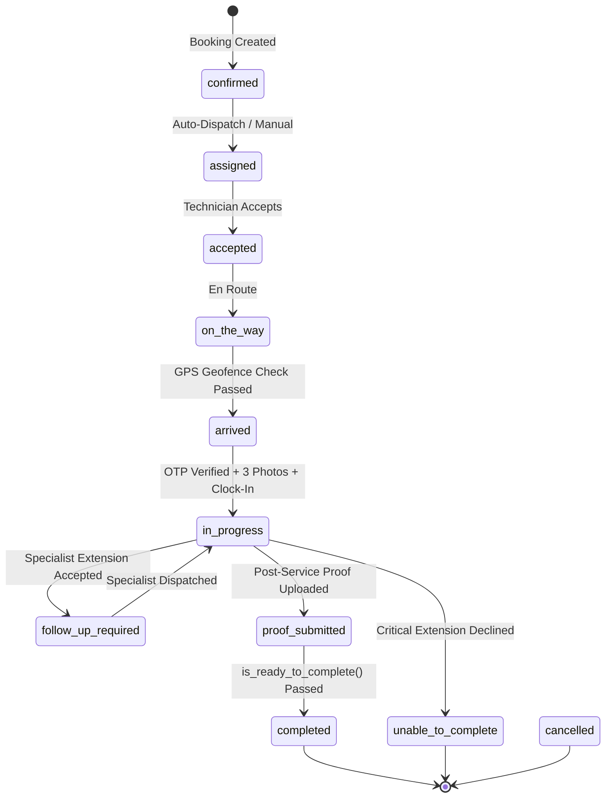

# Customer / Marketplace & Workforce Integration Contract

> **Target Audience:** Customer App, Marketplace Web, and Partner Integration Engineering Teams.  
> **Source of Truth:** `workforce-app` Backend APIs (`/api/workforce/*`) and Supabase PostgreSQL.

---

## 1. Authentication & Security Model

All customer-facing endpoints enforce strict tenant and customer authorization:

1. **Authenticated Customer Session:**
   - Standard JWT / Bearer token or session cookie identifying the customer user.
   - The backend validates that `ServiceRequest.customer == request.user` or matches registered customer contact identifiers.
2. **Cryptographic Decision Tokens (`decision_token`):**
   - For transactional links (e.g. SMS / WhatsApp / Email review links for Additional Work decisions), a secure URL-safe 32-byte token is issued upon Admin approval.
   - Passed via path parameter `/api/workforce/customer/extension-token/{token}/` or HTTP header `X-Decision-Token`.
3. **Strict Authorization Rules:**
   - Technicians and unrelated customers are strictly blocked (`403 Forbidden`).
   - Customer IDs, technician IDs, and Company IDs supplied in request bodies are ignored; ownership is resolved strictly server-side.

---

## 2. ServiceRequest Lifecycle States



| Status | Description | Customer Visibility |
| :--- | :--- | :--- |
| `confirmed` | Booking confirmed and queued for dispatch | "Finding your technician" |
| `assigned` / `accepted` | Technician assigned and accepted job | "Technician assigned: [Name]" |
| `on_the_way` | Technician is traveling to customer site | "Technician is on the way" |
| `arrived` | Technician arrived at site; OTP generated | "Technician has arrived! Share your Start OTP" |
| `in_progress` | OTP verified, pre-service proof verified, work started | "Service in progress" |
| `follow_up_required` | Specialist referral accepted; awaiting specialist | "Specialist follow-up scheduled" |
| `proof_submitted` | Technician submitted after-service proof | "Service finished, finalizing report" |
| `completed` | All primary, extension, and specialist tasks done | "Service completed successfully" |
| `unable_to_complete` | Critical extension declined; service stopped | "Service could not be completed" |
| `cancelled` | Booking cancelled | "Service cancelled" |

---

## 3. Customer Work Start OTP Delivery

When the technician arrives at the customer site and passes the GPS geofence check, the backend generates a random 6-digit cryptographic OTP valid for 15 minutes.

### 3.1 Get Active Work Start OTP

- **HTTP Method:** `GET`
- **Endpoint:** `/api/workforce/customer/jobs/{job_id}/otp/` (or `/api/workforce/jobs/{job_id}/customer-otp/`)
- **Authentication:** Customer JWT or Session

#### Response `200 OK`:
```json
{
  "job_id": 142,
  "request_id": "SR-0142",
  "otp_code": "582914",
  "otp_state": "ACTIVE",
  "expires_at": "2026-08-13T11:15:00.000Z",
  "is_verified": false,
  "otp_attempts": 0,
  "customer_message": "Your Work Start Verification Code: 582914. Share this code with your technician upon arrival.",
  "authorized_action": "START_WORK_AND_CLOCK_IN"
}
```

#### OTP States:
- `ACTIVE`: Valid 6-digit code ready to share with technician.
- `EXPIRED`: 15-minute validity elapsed. Technician must trigger site arrival re-verification.
- `VERIFIED`: Technician has entered the code; work authorization granted.

#### Error Responses:
- `403 Forbidden`: `{"error": "Unauthorized: Only the booking customer or admin may view the Customer Work Start OTP."}`
- `404 Not Found`: `{"error": "Work Start OTP has not been generated yet. Technician must arrive at the job location first."}`

---

## 4. Additional Work & Scope Extension Decision

When a technician identifies required or recommended additional work (e.g. part replacement, extra wiring, refrigerant top-up), the request is reviewed by Admin and presented to the customer.

### 4.1 Get Additional Work Details

- **HTTP Method:** `GET`
- **Endpoints:**
  - Authenticated: `/api/workforce/customer/jobs/{job_id}/extension/{ext_id}/`
  - Token-Based: `/api/workforce/customer/extension-token/{decision_token}/`

#### Response `200 OK`:
```json
{
  "extension_id": 88,
  "job_id": 142,
  "request_id": "SR-0142",
  "original_service": "AC Regular Servicing & Jet Clean",
  "title": "Copper Pipe & Flare Nut Replacement",
  "description": "Replace 3 meters of corroded copper piping and flare nuts to stop refrigerant leak.",
  "reason": "Severe oxidation and micro-cracks on existing suction pipe.",
  "estimated_labor_cost": "450.00",
  "estimated_materials_cost": "750.00",
  "requested_amount": "1200.00",
  "admin_approved_amount": "1150.00",
  "final_customer_amount": "1150.00",
  "is_critical": true,
  "requires_specialist": false,
  "status": "ADMIN_APPROVED",
  "decision_expires_at": "2026-08-14T11:00:00.000Z",
  "is_expired": false,
  "created_at": "2026-08-13T10:45:00.000Z"
}
```

---

### 4.2 Customer Decides on Additional Work

Customer records a one-time decision (`ACCEPT` or `DECLINE`).

- **HTTP Method:** `POST`
- **Endpoints:**
  - Authenticated: `/api/workforce/customer/jobs/{job_id}/extension/{ext_id}/decide/`
  - Token-Based: `/api/workforce/customer/extension-token/{decision_token}/decide/`

#### Request Body:
```json
{
  "action": "ACCEPT",
  "reason": "Customer approved verbally on site"
}
```
*(For decline: `"action": "DECLINE", "reason": "Customer prefers to replace appliance"`)*

#### Behavior Matrix:

| Decision | `is_critical` | `requires_specialist` | Extension Status | ServiceRequest Status | Financial Impact |
| :--- | :--- | :--- | :--- | :--- | :--- |
| **ACCEPT** | Any | `False` | `CUSTOMER_ACCEPTED` | Continues `in_progress` | `total_amount += approved_amount` |
| **ACCEPT** | Any | `True` | `PENDING_ASSIGNMENT` | `follow_up_required` | Specialist job scheduled |
| **DECLINE** | `False` (Optional) | Any | `CUSTOMER_DECLINED` | Continues `in_progress` | `total_amount` unchanged |
| **DECLINE** | `True` (Critical) | Any | `CUSTOMER_DECLINED` | `unable_to_complete` | Service stopped safely |

#### One-Time & Idempotency Rules:
- If a customer attempts to decide on an extension that has already been decided:  
  **Status `409 Conflict`**:
  ```json
  {
    "error": "Decision already recorded for extension #88. Status is 'CUSTOMER_ACCEPTED'. Further decisions are rejected.",
    "code": "DECISION_ALREADY_RECORDED",
    "status": "CUSTOMER_ACCEPTED"
  }
  ```
- If the 24-hour decision window has elapsed:  
  **Status `400 Bad Request`**:
  ```json
  {
    "error": "Decision window has expired for this work extension. Please request an updated estimate.",
    "code": "DECISION_EXPIRED"
  }
  ```

---

## 5. Specialist Referral & Secondary Job Workflow

When an approved extension requires specialized skills (e.g. PCB micro-soldering, duct fabrication):

1. **Customer Accepts:** Extension becomes `PENDING_ASSIGNMENT`; parent job becomes `follow_up_required`.
2. **Admin Assigns Specialist:** Admin assigns Specialist Technician B (`POST /api/workforce/admin/jobs/{job_id}/extension/{ext_id}/assign-specialist/`).
3. **Secondary Job Created:**
   - A dedicated `ServiceRequest` is created (`is_primary = False`) linked to the parent job.
   - **Privacy Isolation:** Technician B only receives the sanitized task description, service category, customer address, and scope requirements. Technician A's internal hourly rate, payroll, and private logs are **not** exposed.
4. **Completion:**
   - Technician A completes primary work and uploads proof.
   - Technician B completes specialist work.
   - Extension moves to `RESOLVED`.
   - Parent case evaluates `is_ready_to_complete()` and marks `completed`.

---

## 6. Authoritative Job Completion Aggregation

The workforce backend enforces that a `ServiceRequest` can **never** be completed prematurely.

`ServiceRequest.is_ready_to_complete()` validates:
1. **Primary Job Proof:** Post-service photos and notes submitted.
2. **All Extensions Resolved:** No open extensions in `REQUESTED`, `ADMIN_APPROVED`, `PENDING_ASSIGNMENT`, `CUSTOMER_ACCEPTED`, or `IN_PROGRESS`.
3. **All Specialist Jobs Completed:** All secondary specialist jobs must be in `completed` status.
4. **No Operational Blockers:** Unresolved dependencies block completion.

---

## 7. Supplemental Invoicing & Billing

Accepted Additional Work is billed via dedicated `WorkforceSupplementalInvoice` records, preserving the original booking invoice intact.

### 7.1 List Supplemental Invoices for Job

- **HTTP Method:** `GET`
- **Endpoint:** `/api/workforce/customer/jobs/{job_id}/supplemental-invoices/`

#### Response `200 OK`:
```json
[
  {
    "id": 12,
    "invoice_number": "SUP-INV-142-88",
    "job": 142,
    "extension": 88,
    "customer_name": "Alice Smith",
    "amount": "1150.00",
    "actual_cost": "1150.00",
    "status": "ISSUED",
    "payment_method": "COD",
    "transaction_id": null,
    "paid_at": null,
    "metadata": {
      "extension_title": "Copper Pipe & Flare Nut Replacement",
      "reason": "Severe oxidation and micro-cracks on existing suction pipe."
    },
    "created_at": "2026-08-13T11:00:00.000Z"
  }
]
```

### 7.2 Pay Supplemental Invoice

- **HTTP Method:** `POST`
- **Endpoint:** `/api/workforce/customer/supplemental-invoice/{invoice_id}/pay/`

#### Request Body:
```json
{
  "payment_method": "ONLINE",
  "transaction_id": "TXN_RAZORPAY_991823719"
}
```

#### Response `200 OK`:
```json
{
  "message": "Supplemental invoice #SUP-INV-142-88 paid successfully.",
  "invoice": {
    "id": 12,
    "invoice_number": "SUP-INV-142-88",
    "status": "PAID",
    "payment_method": "ONLINE",
    "transaction_id": "TXN_RAZORPAY_991823719",
    "paid_at": "2026-08-13T11:05:00.000Z"
  }
}
```

---

## 8. Rescheduling Rules & Customer Delay Escalations

Delays (parts unavailability, specialist dispatch, weather) follow strict customer-protection rules:

### Delay Rules:
1. **1st Delay:**
   - Proposed service date is updated.
   - Customer notification is dispatched.
   - Audit record created with reason and delay type.
   - Previously approved commercial amounts remain **strictly untouched**.
2. **2nd Delay:**
   - Proposed schedule is **frozen** (not silently postponed).
   - Priority Customer Support callback escalation is created.
   - Customer notification is dispatched with callback options.

### 8.1 Customer Reschedule Response / Objection

- **HTTP Method:** `POST`
- **Endpoint:** `/api/workforce/customer/jobs/{job_id}/reschedule-response/`

#### Request Body:
```json
{
  "response": "CALLBACK_REQUESTED",
  "notes": "Need service completed before Friday morning"
}
```
*(Options: `ACCEPTED`, `OBJECTED`, `CALLBACK_REQUESTED`)*

---

## 9. Error Codes Summary

| HTTP Status | Error Code | Description |
| :--- | :--- | :--- |
| `400` | `INVALID_OTP` | Provided OTP does not match. Remaining attempts returned. |
| `400` | `OTP_EXPIRED` | OTP 15-minute validity has expired. |
| `400` | `MAX_OTP_ATTEMPTS_EXCEEDED` | 5 failed OTP attempts reached. Re-arrival required. |
| `400` | `DECISION_EXPIRED` | 24-hour decision window has elapsed. |
| `400` | `PRE_SERVICE_INCOMPLETE` | Clock-in attempted without all 5 pre-service proofs. |
| `403` | `FORBIDDEN` | Caller is not authorized for this customer booking. |
| `404` | `NOT_FOUND` | Job, extension, or invoice not found. |
| `409` | `DECISION_ALREADY_RECORDED` | Duplicate or conflicting customer decision rejected. |
